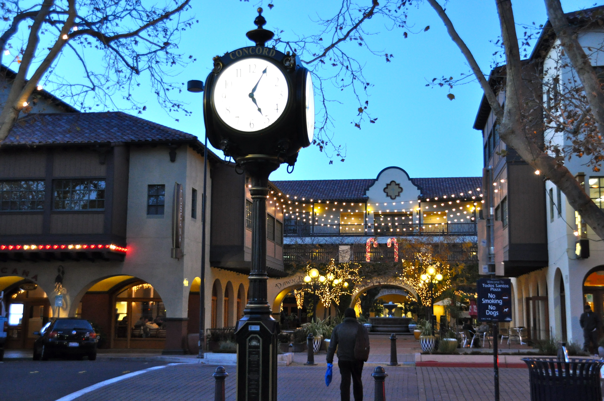

# CSC 317 Assignment 2 Submission

**Name:** Meridian Helmantoler
**Student ID:** 924036006
**GitHub Username:** KirbMH  
**Assignment Number:** 2  


##  HTML Personal Portfolio Website Assignment

### Description:
For this assignment we created a personal portfolio page that introduces us to writing and reading HTML files as well as some CSS inline styling. For this assignment I mixed in some fun elements because I don't have much of a portfolio yet.


## Approach / What I Did:
For the most part I followed the project requirement but I also have taken a similar class before that helped me know how to write the document. I wanted to have some fun with the page so I added some embellishments, color, images, gifs, and extra buttons and fields into the page. I made up some projects based off some gifs I think are fun, and added an iframe for a random website as embedding a maps location doesnt seem to be possible.


## Code Explanation:
For the header section I made it so my profile picture was beside my name instead of on top pushing down the text by using a float style tag which moved it to the left. I also used a float element for the instagram link.And then I used an unordered list and removed the bullet points for the navigation.

```html
<header>
    
    
    <h1 style="padding-left: 50px; color: aliceblue;">Meridian Helmantoler <br> <span style="font-size: 15px;">They / Them</span></h1>
    <a href="https://www.instagram.com/kirbst_/"></a>

    <nav>
        <ul style="list-style-type: none; margin: 10px;">
            <li><a style="padding: 10px;" href="#About">About</a>
                <a style="padding: 10px;" href="#Education">Education</a>
                <a style="padding: 10px;" href="#Experience">Experience </a>
                <a style="padding: 10px;" href="#Contact">Contact</a>
            </li>
         </ul>  
    </nav>


    </header>

```

For the about section I used a div to make it take up only half the page so I could put the image of my city next to it as a float element, however I hope to learn a better way of implementing images in the future. I also added some inline span tags to try out some text customization for the about section.

```html
<section id="About">
            <br>
            
            <h2>About Me</h2>
            <div style="display: block; width: 50%;">
            <p style="padding-left: 10px;">Hi, my name is <span style="background-color: blue; padding: 0.5%;">Meridian Helmantoler</span>,
                 I am a junior <span style="background-color: greenyellow; padding: 0.5%; color: black;">Computer Science</span> major at SFSU.</p>
            <p> <span style="background-color: rgb(253, 230, 119); color: black; padding: 0.5%;">From Concord, CA</span></p>    
            </div>
            
        </section>
```
For the education section I used a table for my current education and past achievments, adding some extra black table data so that it would look how I wanted it to. I also added the images into the table so that it would be right next to the university name.

```html

 <h2>Education</h2>
        <table>

            <tr>
                <td style="width: 10px;"></td>
                <th>San Francisco State University</th>
                <td></td>
            </tr>
            <tr>
                <td style="text-align: center;"><b>Major</b></td>
                <td>Computer Science</td>
                <td ><b>2024 - 2026</b></td>
            </tr>
            <tr>
                <td style="width: 10px;"></td>
                <th style="text-align: left;">Diablo Valley College</th>
                <td></td>
            </tr>
            <tr>
                <td style="text-align: center;"><b>Degree</b></td>
                <td> Associates in Computer Science</td>
                <td><b>2022 - 2024</b></td>
            </tr>
            <tr>
                <td style="text-align: center;"><b>Degree</b></td>
                <td > Associates in Art Digital Media</td>
                <td><b>2018 - 2022</b></td>
            </tr>
        </table>

```
